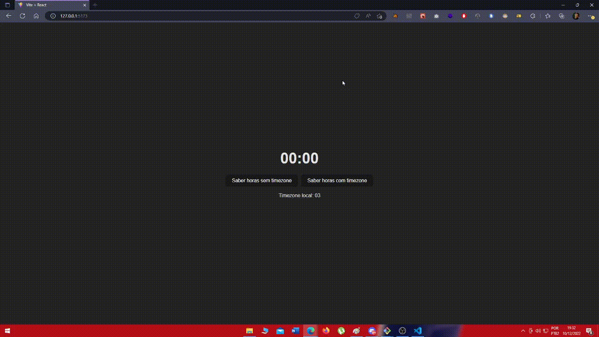

# desafio-clicks-circulos-em-tela
Desafio front-end utilizando React

  <h1 align="center" > 
    🕒
    Lidando com Timezone </h1> 
  
  
Print Aplicação

 

  
<h1>💻 Descrição</h1>

Uma aplicação simples para entendimento do timezone por região diferente qual pode implicar na visualização de data/hora em um sistema distribuído. Tal aplicação foi base para implementação em outro projeto.

 

<h1>🚀 Tecnologias</h1>
 

Esse projeto é um estudo de Front End usando as seguintes tecnologias:

- ✔️ React  
- ✔️ Vite  
- ✔️ data-fns  

 

<h1>ℹ️ Como usar</h1>

<pre>

# Clone o repositorio
$ git clone https://github.com/Ulisses97/lidando-com-timezone.git

# Entre na pasta do repositorio 
$ cd lidando-com-timezone

# Instale as dependências
$ yarn install

# Execute o projeto
$ yarn dev

<footer>
Feito com o ♥ por <a href="https://www.instagram.com/ulisses.brandao/">Ulisses Brandão</a>👋
  

☕Bora tomar um café e conversarmos melhor?
</footer>
